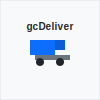
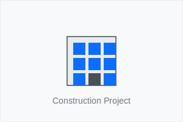

# Image Assets for gsDeliver Dashboard

## Created Images

1. **company-logo.svg**
   - Purpose: Company logo for settings page and branding
   - Size: 100x100px
   - Location: `images/company-logo.svg`

2. **placeholder.svg**
   - Purpose: Generic placeholder for missing images
   - Size: 400x300px
   - Location: `images/placeholder.svg`

3. **user-avatar.svg**
   - Purpose: Default user profile picture
   - Size: 40x40px
   - Location: `images/user-avatar.svg`

4. **project-placeholder.svg**
   - Purpose: Placeholder for project images
   - Size: 300x200px
   - Location: `images/project-placeholder.svg`

5. **item-placeholder.svg**
   - Purpose: Placeholder for item/material images
   - Size: 200x200px
   - Location: `images/item-placeholder.svg`

6. **partner-placeholder.svg**
   - Purpose: Placeholder for partner company logos
   - Size: 200x200px
   - Location: `images/partner-placeholder.svg`

## Implementation Guide

### Update File Structure
```
gsdeliver-dashboard/
│
├── images/
│   ├── company-logo.svg
│   ├── placeholder.svg
│   ├── user-avatar.svg
│   ├── project-placeholder.svg
│   ├── item-placeholder.svg
│   └── partner-placeholder.svg
│
├── css/
├── js/
└── ... (other files)
```

### HTML Updates

1. **Replace placeholder URLs in Settings page:**
```html
<!-- Before -->


<!-- After -->

```

2. **Add default user avatar to sidebar:**
```html
<!-- Update user section in sidebar component -->
<div class="user-section">
    <div class="d-flex align-items-center">
        
        <div>
            <div class="user-name">Admin User</div>
            <small class="text-muted">General Contractor</small>
        </div>
    </div>
</div>
```

3. **Optional: Add placeholder images to cards:**
```html
<!-- Project Card with image -->
<div class="project-card">
    
    <div class="card-body">
        <!-- Card content -->
    </div>
</div>

<!-- Partner Card with logo -->
<div class="partner-card">
    <div class="d-flex align-items-center mb-3">
        
        <div>
            <h5>Partner Company Name</h5>
            <!-- Other details -->
        </div>
    </div>
</div>
```

## Color Scheme Used

- Primary Blue: `#0d6efd`
- Secondary Blue: `#0b5ed7`
- Gray: `#6c757d`
- Light Gray: `#e9ecef`
- Background: `#f8f9fa`
- Dark: `#212529`
- Warning (Yellow): `#ffc107`

## Additional Image Needs

If you need more specific images, consider creating:

1. **Weather Icons** - for daily reports
2. **Material Type Icons** - for different item categories
3. **Status Icons** - for various states (pending, complete, etc.)
4. **Chart/Graph Icons** - for data visualization sections
5. **Construction Equipment Icons** - for equipment tracking

These SVG images are scalable and can be easily customized by changing colors or sizes in the SVG code.
